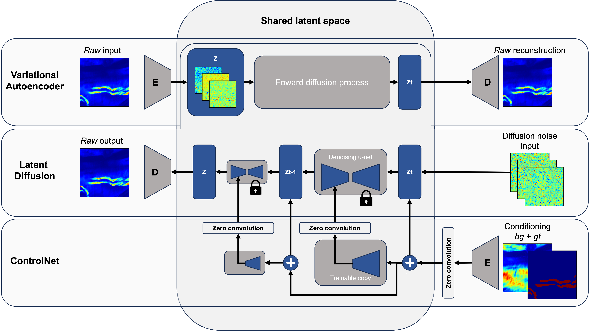

# Synthetic Neuron Image Generation

The goal of this project is to generate synthetic neuron images (`raw`) from **auto-fluorescence** (`bg`) scans and neuron binary masks (`gt`).  



We achieve this using the following methods:  
- **Variational Autoencoder (VAE)**  
- **Latent Diffusion Model (LDM)**  
- **ControlNet (CN)**  

## Methodology  

1. **Training**  
   - The **VAE** and **LDM** were trained on the `raw` channel.  
   - The `bg` and `gt` channels were used as conditioning inputs the for **ControlNet**.  

2. **Results**  
   - The ControlNet achieved good results overall.  
   - However, it failed to accurately reconstruct nerve pathways, requiring further work in this area. 


## Usage  

### Training  

1. Fill out the `params.json` file. Detailed instructions are available in [params-json.md](params-json.md).  
2. Run the training script:  
   ```bash
   bash run.sh
   ```
### Inference  

1. Fill out the `params.json` file.  
2. Run the inference script:  
   ```bash
   bash run_inf.sh
   ```
### Metrics Calculation

1.	Fill out the `cn.txt` or `vae_ldm.txt` file.
2.	Fill out the `params.json` file.
3.	Run the metrics calculation script:
    ```bash
    bash run_metrics_calc.sh
    ```
